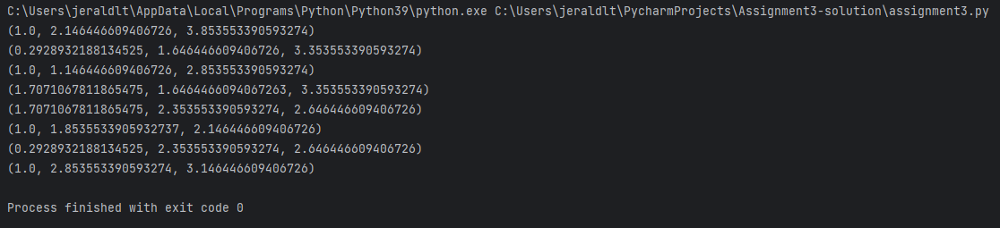
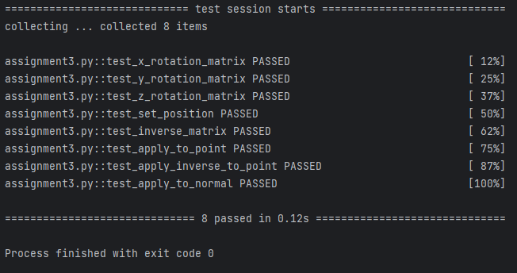

# Programming Assignment 3

Class: 

Professor: 

## Overview

In this programming assignment, you are going to complete the third step towards building our renderer: the transform 
module. As discussed in class, our renderer is going to be composed of several independent modules. The transform 
module is responsible for definining a data structure that will store a position and orientation. Specifically, it 
will provide a class called `Transform` that stores this information. The `Transform` class will also provide 
exposed methods that allow the renderer to move and/or rotate the transform. Please read the entire document 
before starting the assignment.


## Instructions

For this assignment, you will create a python file called `transform.py`, and within that file there will be a class 
called `Transform`. `Transform` needs to be implemented as detailed below. 

Now that we are able to store representations of 3D meshes, we need to be able to manipulate them in our 3D scene. 
This will be accomplished by adding a `Transform` object as a member of the `Mesh` class. This member should 
automatically be populated with a default value that represents a position at the origin and no rotation. In 
otherwords, the default transformation matrix should be the identity matrix.

Like Assignment 2, this assignment will make use of numeric checks on known transforms to validate your solutions, as 
visual validation is not possible not possible until we have methods to shade objects in our raster renderer.

Tip: While you are free to store the transform's values however you see fit, I recommend storing it as a 4x4 
transformation matrix, and extracting specific elements as needed.


### Output

The following should be the output when `assignment3.py` is run:

```bash
python assignment3.py
```



Note that this requires that the `Mesh` class has a `Transform` object member.

The following should be the output when pytest with the verbose flag is run:

```bash
pytest -v assignment3.py
```



### Dependency Management
Each assignment will include a requirements.txt file that includes the python package requirements for the assignment. If you are using PyCharm it should automatically detect and install the dependencies when you create the virtual environment. Otherwise, [these instructions](https://www.jetbrains.com/help/pycharm/managing-dependencies.html#configure-requirements) will help you manually manage the requirements in PyCharm. If you are using something other than PyCharm, you can use the command line to manually install the packages from the requirements.txt file:

```bash
pip install -r requirements.txt
```

## The Transform Class

### Exposed Members

There are no exposed members of the `Transform` class

### Exposed Methods

#### `__init__(self)`
The constructor takes no required arguments.

#### `transformation_matrix(self)`
Returns a 4x4 Numpy matrix that represents the transformation matrix

#### `set_position(self, x, y, z)`
This method takes three scalars (x, y, and z) as input, and updates the `Transform` object's internal
state to represent a new position at `(x, y, z)`.

#### `set_rotation(self, x, y, z)`
This method takes three scalars (x, y, and z) as input, and updates the `Transform` object's interal rotation state. 
The input values x, y, and z are expected to be degrees values between 0.0 and 360.0 (there is no need to check this)
, and represent the amount of rotation around the x, y, and z axis respectively. The rotation should be set using 
the ZYX order of rotation.

#### `inverse_matrix(self)`
This method returns a 4x4 Numpy matrix that is the inverse of the transformation matrix.

#### `apply_to_point(self, p)`
This method takes a 3 element Numpy array, `p`, that represents a 3D point in space as input. It then applies the 
transformation matrix to it, and returns the resulting 3 element Numpy array.

#### `apply_inverse_to_point(self, p)`
This method takes a 3 element Numpy array, `p`, that represents a 3D point in space as input. It then applies the 
inverse transformation matrix to it, and returns the resulting 3 element Numpy array.

#### `apply_to_normal(self, n)`
This method takes a 3 element Numpy array, `n`, that represents a 3D normal vector. It then applies the 
transform's rotation to it, and returns the resulting 3 element Numpy array. The resulting array should be 
normalized and should not be affected by any positional component within the transform.

## Extra Credit
For 2 points of extra credit, you may add another method to your `Transform` class with the definition:

```set_axis_rotation(self, axis, rotation)```

This method will take a 3D numpy array as the axis input, and a scalar in degrees as the rotation input. As 
described in this [Wikipedia article](https://en.wikipedia.org/wiki/Axis%E2%80%93angle_representation), all 3D 
rotations can be represented as a single rotation around a single axis (as opposed to 3 different rotations around 
the x, y, and z axes). This method will calculate the rotation resulting from the amount of input rotation rotating 
around the input axis and update its internal rotation representation as such. To evaluate the extra credit, pytest 
will be run on `extracredit.py`. To get the extra credit points, all tests must pass.

## Rubric
There are 20 points (22 with extra credit) for this assignment:
- *2 pts*: pytest test_x_rotation_matrix passed
- *2 pts*: pytest test_y_rotation_matrix passed
- *2 pts*: pytest test_z_rotation_matrix passed
- *2 pts*: pytest test_set_position passed
- *2 pts*: pytest test_inverse_matrix passed
- *2 pts*: pytest test_apply_to_point passed
- *2 pts*: pytest test_apply_inverse_to_point passed
- *2 pts*: pytest test_apply_to_normal passed
- *4 pts*: Printed vertex values match expected output after assignment3.py (see above)
